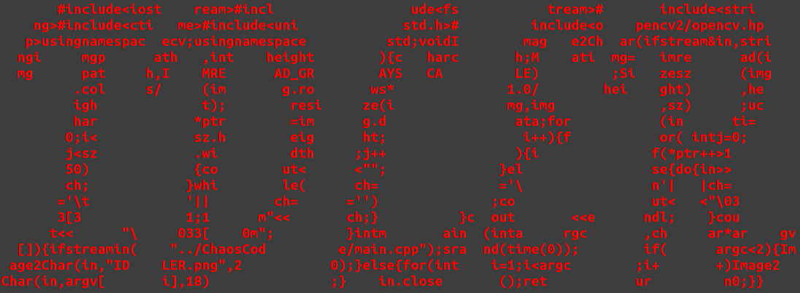

# Registration

## Developer

## Introduction
This procedure implemented by C plus plus with Open Soure Library **OpenCV**, **PCL**, and **Realsense Developer SDK**.

## Intel Realsense F200 
### Official Statement
**Intel® RealSense™** camera fits remarkable technology into a small package. There are three cameras that act like one—a 1080p HD camera, an infrared camera, and an infrared laser projector—they “see” like the human eye to sense depth and track human motion. Intel® RealSense™ technology1 redefines how we interact with our devices for a more natural, intuitive and immersive experience, supported by the powerful performance of Intel® processors.
### More details
And you can find more details with Realsense on https://software.intel.com/en-us/intel-realsense-sdk/download

## Procedure
This program consists of four parts: Segmentation, classification, registration and reflection. First, depth data can be divided into serval regions with improved region-growing segmentation. Then classifly region catergory with a classic linear svm with HOG as feature. Next, regist mesh generated by Realsense with 3D-model which we built by 3D scanner inadvance. Last but not least, reflect Points Cloud to 2D-color-image. Finally, we can see **purple point** in folowing picture.
### Segmentation
An improved region-growing segmentation efficiently divide depth data into **topk** main regions. 
### Classification
An classic **Support Vector Machine (SVM)** with **Histogram of Oriented Gradient (HOG)** as feature rapidly select regions contained objects.
### Registration
Regist Point Cloud (3D mesh) with pre-built 3D-model, by **RANSAC** and **ICP**.
### Reflection
Reflect points into 2D image. 

## Example
### Interpretion
**color** and **depth** are soure data captured by Realsense. **before merging** is raw result with region-growing and **segmentation** merge small regions into representive regions as main regions. **regions** show the bounding boxes with convex hulls of main regions. And **classification** show region which probably contains object. The 3D Point Cloud window show the registration and **reflect** demonstrate the final result. 
### Result

## ERROR & SOLUTION
We just add some solutions which we have finished off into [**Issues**](https://github.com/IDLER1229/Registration/issues). Welcome You to push problems you faced with.